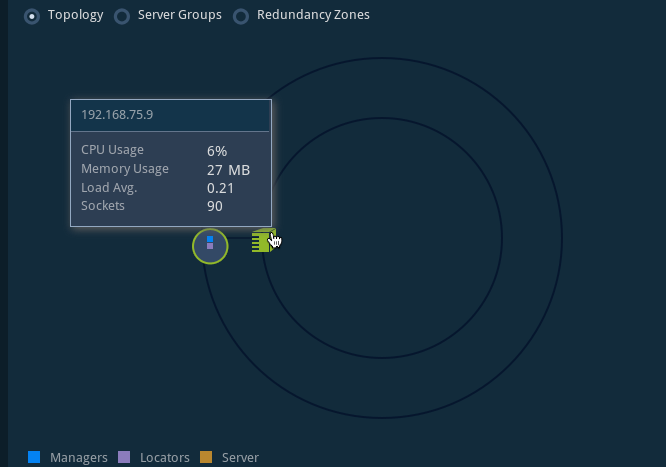
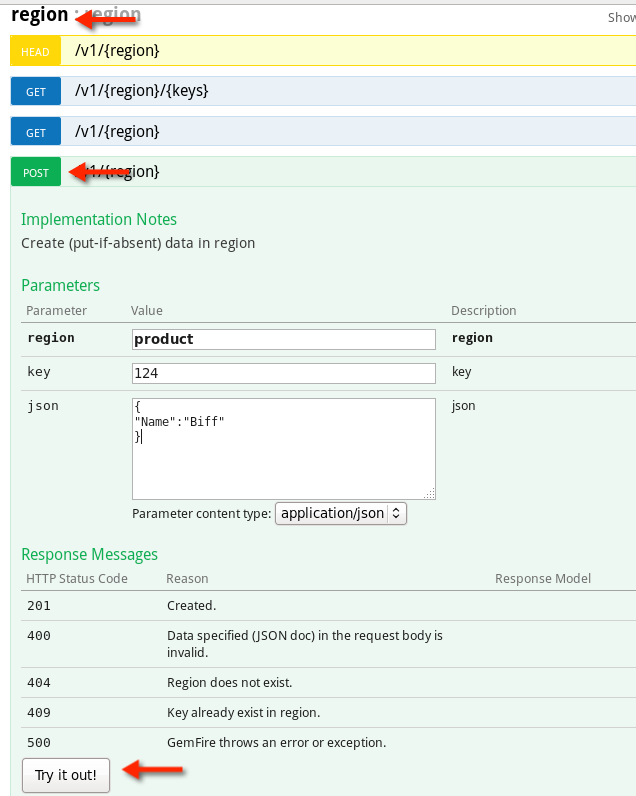

= Gemfire Lab
The purpose of this lab is to get a basic understanding of how a Gemfire cluster works and how it can be used.

== Prerequisites
Required Pivotal Products: +
- Gemfire 8.1

If you are working with the Amazon Image (AMI:ami-aaf1dac2) a remote desktop client that supports an RDP connection may be required.

For Mac OSX CoRD is reccommended. CoRD is free to download and can be obtained from this site: http://cord.sourceforge.net/

For Windows the included Remote Desktop Connection can be used: http://windows.microsoft.com/en-ca/windows/connect-using-remote-desktop-connection#connect-using-remote-desktop-connection=windows-7

The username and password for the AMI image is gpadmin/bebold.

=== Setting up the terminal session
All instructions assume that the terminal session is started in the labs directory of the roadshow project. +
Within the terminal execute the following steps: +
[source]
----
[pivhdsne:Desktop]$ cd BigDataRoadshow
[pivhdsne:BigDataRoadshow]$ cd labs/
[pivhdsne:labs]$ ls
gemfire  phd-hawq  preparing_labs.pdf  springxd
[pivhdsne:labs]$
----

=== Open up the labs instructions
Ensure the lab instructions are open in a browser window: +
https://github.com/Pivotal-Field-Engineering/BigDataRoadshow/blob/master/labs/01-gemfire.adoc +

== Exploring gfsh
gfsh (Gemfire shell) is a interactive command line interface that allows you to, manage, moniter and administrate Gemfire processes. +
Through out this lab gfsh will be used to start and stop processes and also to initiate other commands to the cluster. +
All instructions assume commands are being executed in gfsh and also that gfsh was launched from the labs folder of the BigDataRoadShow workspace. +
To get this folder do the following: +
[source]
----
[pivhdsne:Desktop]$ cd BigDataRoadshow-labs
[pivhdsne:BigDataRoadshow]$ cd labs/
[pivhdsne:labs]$ ls
gemfire  phd-hawq  preparing_labs.pdf  springxd
[pivhdsne:labs]$
----
From within labs folder start up a gfsh session: +
[source]
----
[pivhdsne:labs]$ pwd
/home/gpadmin/Desktop/BigDataRoadshow/labs
[pivhdsne:labs]$ gfsh
    _________________________     __
   / _____/ ______/ ______/ /____/ /
  / /  __/ /___  /_____  / _____  / 
 / /__/ / ____/  _____/ / /    / /  
/______/_/      /______/_/    /_/    v8.1.0

Monitor and Manage GemFire
gfsh>
----

gfsh is interactive and contains auto completes to assist users. This functionality can be triggered by pressing the tab key. Press tab now to list all the commands gfsh can perform.

== Starting The First Member of the Cluster
The locator is a Pivotal GemFire process that tells new, connecting members/clients where running members are located and provides load balancing for server use. +
This locator will be the first member in the cluster and will act as the membership coordinator as well as the management node. +
Copy and paste the following command into gfsh: +
[source,bash]
----
start locator --name=locatorA --enable-cluster-configuration=false --J=-Dgemfire.http-service-port=7575
----

The command will produce an output similar to this: +
[source,bash]
----
gfsh>start locator --name=locatorA --enable-cluster-configuration=false --J=-Dgemfire.http-service-port=7575
Starting a GemFire Locator in /home/gpadmin/Desktop/BigDataRoadshow/labs/locatorA...
...
Locator in /home/gpadmin/Desktop/BigDataRoadshow/labs/locatorA on ip-172-31-35-243.ec2.internal[10334] as locatorA is currently online.
Process ID: 31260
Uptime: 4 seconds
GemFire Version: 8.1.0
Java Version: 1.7.0_45
Log File: /home/gpadmin/Desktop/BigDataRoadshow/labs/locatorA/locatorA.log
JVM Arguments: -Dgemfire.enable-cluster-configuration=false -Dgemfire.load-cluster-configuration-from-dir=false -Dgemfire.http-service-port=7575 -Dgemfire.launcher.registerSignalHandlers=true -Djava.awt.headless=true -Dsun.rmi.dgc.server.gcInterval=9223372036854775806
Class-Path: /opt/pivotal/gemfire/Pivotal_GemFire_810/lib/gemfire.jar:/opt/pivotal/gemfire/Pivotal_GemFire_810/lib/locator-dependencies.jar

Successfully connected to: [host=ip-172-31-35-243.ec2.internal, port=1099]
----
Congratulations, you now have the beginning of a Gemfire cluster. +
Wait for the previous command to finish before preceding to the next step. +

== Log Into Pulse
GemFire Pulse is a Web Application that provides a graphical dashboard for monitoring vital, real-time health and performance of GemFire clusters, members, and regions. +
With the first locator started, Pulse is now available. +
To use Pulse, open a browser and enter this URL in the address bar: +
http://localhost:7575/pulse/Login.html +

Alternatively the following command can be typed into gfsh to launch Pulse in the browser: +
start pulse --url=http://localhost:7575/pulse

Log into Pulse with the following credentials: +
username: *admin* +
password: *admin* +
Once logged in click on green server box Icon in the Cluster View to see the Gemfire processes running on the server. +
For the lab all processes will be on this machine. +

== Start another Locator
This locator will join with the first giving the cluster fail over for Locator functionality. +
Return to the gfsh session and enter the following command: +
[source,bash]
----
start locator --name=locatorB --enable-cluster-configuration=false --locators=127.0.0.1[10334],127.0.0.1[10335] --port=10335 --J=-Dgemfire.http-service-port=7576
----
The resulting output should look like the following: +
[source]
----
gfsh>start locator --name=locatorB --enable-cluster-configuration=false --locators=127.0.0.1[10334],127.0.0.1[10335] --port=10335 --J=-Dgemfire.http-service-port=7576
Starting a GemFire Locator in /home/gpadmin/Desktop/BigDataRoadshow/labs/locatorB...
.........
Locator in /home/gpadmin/Desktop/BigDataRoadshow/labs/locatorB on ip-172-31-35-243.ec2.internal[10335] as locatorB is currently online.
Process ID: 32282
Uptime: 4 seconds
GemFire Version: 8.1.0
Java Version: 1.7.0_45
Log File: /home/gpadmin/Desktop/BigDataRoadshow/labs/locatorB/locatorB.log
JVM Arguments: -Dgemfire.locators=127.0.0.1[10334],127.0.0.1[10335] -Dgemfire.enable-cluster-configuration=false -Dgemfire.load-cluster-configuration-from-dir=false -Dgemfire.http-service-port=7576 -Dgemfire.launcher.registerSignalHandlers=true -Djava.awt.headless=true -Dsun.rmi.dgc.server.gcInterval=9223372036854775806
Class-Path: /opt/pivotal/gemfire/Pivotal_GemFire_810/lib/gemfire.jar:/opt/pivotal/gemfire/Pivotal_GemFire_810/lib/locator-dependencies.jar
----

Pulse will now show two locator processes. Also in the panel across the top the Total Heap, Members and Locators counts will have increased.

== Add Server A
A GemFire server is a Pivotal GemFire process that runs as a long-lived, configurable member of a distributed system. +
The server is what contains the Regions which in turn contains the data. Servers can also bring the compute to the data, similar to stored Procedures, by deploying java logic into them. +

To start a server process copy the following command into gfsh: +
[source,bash]
----
start server --name=serverA --use-cluster-configuration=false --server-port=0 --locators=127.0.0.1[10334],127.0.0.1[10335] --J=-Dgemfire.http-service-port=7577 --J=-Dgemfire.start-dev-rest-api=true --J=-Xms128m --J=-Xmx128m
----

The output will look similar to this: +

[source]
----
Server in /home/gemfire/serverA on 192.168.75.9[33971] as serverA is currently online.
Process ID: 88547
Uptime: 9 seconds
GemFire Version: 8.1.0
Java Version: 1.7.0_71
Log File: /home/gemfire/serverA/serverA.log
JVM Arguments: -Dgemfire.locators=127.0.0.1[10334],127.0.0.1[10335] -Dgemfire.use-cluster-configuration=false -Dgemfire.http-service-port=7577 -Dgemfire.start-dev-rest-api=true -Xms128m -Xmx128m -XX:OnOutOfMemoryError=kill -KILL %p -Dgemfire.launcher.registerSignalHandlers=true -Djava.awt.headless=true -Dsun.rmi.dgc.server.gcInterval=9223372036854775806
Class-Path: /home/gemfire/gemfire/Pivotal_GemFire/lib/gemfire.jar:/home/gemfire/gemfire/Pivotal_GemFire/lib/server-dependencies.jar
----

Pulse will now also show the new member as well as the increase in memory capacity the addition of this process provided. +

The members can also be viewed in gfsh by typing this command (remember by pressing tab as you type, autocomplete will help):
[source,bash]
----
list members
----

The output will look something like this:
[source]
----
gfsh>list members 
  Name   | Id 
-------- | ----------------------------------------------
locatorB | 192.168.75.9(locatorB:72956:locator)<v1>:20048
serverA  | 192.168.75.9(serverA:88547)<v2>:24402
locatorA | 192.168.75.9(locatorA:72292:locator)<v0>:58229
----

== Add more Members
To add the rest of the members in the grid, the commands look like this. +
[source,bash]
----
start server --name=serverB --use-cluster-configuration=false --server-port=0 --locators=127.0.0.1[10334],127.0.0.1[10335] --J=-Dgemfire.http-service-port=7578 --J=-Dgemfire.start-dev-rest-api=true --J=-Xms128m --J=-Xmx128m
start server --name=serverC --use-cluster-configuration=false --server-port=0 --locators=127.0.0.1[10334],127.0.0.1[10335] --J=-Dgemfire.http-service-port=7579 --J=-Dgemfire.start-dev-rest-api=true --J=-Xms128m --J=-Xmx128m
start server --name=serverD --use-cluster-configuration=false --server-port=0 --locators=127.0.0.1[10334],127.0.0.1[10335] --J=-Dgemfire.http-service-port=7580 --J=-Dgemfire.start-dev-rest-api=true --J=-Xms128m --J=-Xmx128m
----
To save time these have been bundled up into a single file that can be executed from gfsh. Execute the following command (this will only work if gfsh was started from the labs folder of the workspace): +
[source]
----
gfsh>run --file=gemfire/start-more-servers.gfsh
----
At the end of this process a cluster with six members should be visible in gfsh and pulse.
[source,bash]
----
gfsh>list members
  Name   | Id
-------- | ----------------------------------------------
serverB  | 192.168.75.9(serverB:90339)<v3>:5220
serverD  | 192.168.75.9(serverD:90869)<v5>:14761
locatorB | 192.168.75.9(locatorB:72956:locator)<v1>:20048
serverA  | 192.168.75.9(serverA:88547)<v2>:24402
serverC  | 192.168.75.9(serverC:90642)<v4>:39304
locatorA | 192.168.75.9(locatorA:72292:locator)<v0>:58229
----
image::images/pulse-full-cluster-view.png[]

== Adding Regions
The region is the core building block of the Pivotal GemFire distributed system. All cached data is organized into data regions and you do all of your data puts, gets, and querying activities against them. +
Regions behave like HashMaps in that key/value pairs are put into them. +
There are two Region types: +
1. Replicated - when a client sends data to a server and puts a key/value into this type of Region, that key/value is copied to all servers that have that region. +
2. Partitioned - when a client sends data into this type of Region, a hashing policy is performed on the key and using the result, one of the servers is selected to hold that key/value. In most cases redundant copies are made. +
Regions are usually created using XML that is passed into the server on the start server command. +
This is an example: +
[source,xml]
----
<?xml version="1.0" encoding="UTF-8"?>
<cache
    xmlns="http://schema.pivotal.io/gemfire/cache"
    xmlns:xsi="http://www.w3.org/2001/XMLSchema-instance"
    xsi:schemaLocation="http://schema.pivotal.io/gemfire/cache http://schema.pivotal.io/gemfire/cache/cache-8.1.xsd"
    version="8.1">
  <cache-server port="${PORT}" max-connections="${MAXCNXS}"/>
  <region name="root">
    <region-attributes refid="REPLICATE"/>
  </region>
</cache>
----
In this lab, to get a better feel for the process, Regions will be created on the fly using gfsh. The downside of this approach is the Regions are not persistent should a member need to be restarted. The xml configuration options is best for this. +

Add the following command in gfsh:
[source]
----
create region --name=product --type=REPLICATE
----
It will procude an output like this following:
[source]
----
gfsh>create region --name=product --type=REPLICATE
Member  | Status
------- | --------------------------------------
serverC | Region "/product" created on "serverC"
serverB | Region "/product" created on "serverB"
serverA | Region "/product" created on "serverA"
serverD | Region "/product" created on "serverD"
----
In the top banner of Pulse the Regions count will also show 1. +
By clicking the Data tab in Pulse the viewer will show one large region. +

image::images/pulse-data-first-region.png[]

By click on this grey box, Pulse will show how the data is distributed across the servers. +

image::images/pulse-data-first-region-members.png[]

Now create a Partitioned Region.
[source,bash]
----
create region --name=transaction --type=PARTITION --redundant-copies=1
----
For an extra bonus, when using the tab key, the options for Partitioned regions may have come up.
[source]
----
PARTITION                                 
PARTITION_REDUNDANT                       
PARTITION_PERSISTENT                      
PARTITION_REDUNDANT_PERSISTENT            
PARTITION_OVERFLOW                        
PARTITION_REDUNDANT_OVERFLOW              
PARTITION_PERSISTENT_OVERFLOW             
PARTITION_REDUNDANT_PERSISTENT_OVERFLOW   
PARTITION_HEAP_LRU                        
PARTITION_REDUNDANT_HEAP_LRU              
PARTITION_PROXY                           
PARTITION_PROXY_REDUNDANT
----
Gemfire has a lot of configuration options to cover a wide range of use cases (more than be covered during this lab). +
For further reading refer to the Partitioned Regions chapter of the user guide: +
http://gemfire.docs.pivotal.io/latest/userguide/index.html#developing/partitioned_regions/chapter_overview.html

Explore the new regions in Pulse.

== Adding Data Using gfsh
Gemfire is a Key/Value store. Both the keys and the values can be objects or JSON. +
For objects there is support for: +
- Java +
- C# +
- C++ +
Gemfire can store complex object graphs and even has a query language to transverse such structures. +
To keep things simple this lab will use Strings for Keys and Values. +
Also, in most cases, data is inserted into the cluster from a client application (using one of the previously mentioned lanugages). +
For this lab gfsh and the developer REST api will be used.
Run this command in gfsh to do a simple put:
[source,bash]
----
put --region=/product --key="123" --value="ABC"
----
The response will look like this:
[source,bash]
----
gfsh>put --region=/product --key="123" --value="ABC"
Result      : true
Key Class   : java.lang.String
Key         : 123
Value Class : java.lang.String
Old Value   : <NULL>
----
== Quering Data
Gemfire uses a Object Query Language called OQL to access data. Functions can also be ran that return results.
Run this command in gfsh to select the record inserted in the previous step:
[source,bash]
----
query --query="select * from /product"
----
The results will look like this:
[source,bash]
----
gfsh>query --query="select * from /product"

Result     : true
startCount : 0
endCount   : 20
Rows       : 1

Result
---
ABC

----
Another option to query data is to click the Data Browser table in Pulse. There is a query editor where OQL can be entered. The results are displayed below. +
Type (rather than copy/paste) the same query into the web based Data browser in Pulse. +

image::images/pulse-data-browser.png[]

Since OQL queries objects that can contain methods, some interesting possibilities are available. Take a moment to review this section of the userguide: +
http://gemfire.docs.pivotal.io/latest/userguide/index.html#getting_started/querying_quick_reference.html

== Adding More Data
In this step data will be added to the Partitioned Region. +
To do this a gfsh script will be used. +
[source,bash]
----
run --file=gemfire/transactions.gfsh
----
Messages will scroll past in gfsh showing all the puts occuring. +
To get the number of records in the region, type and run this OQL query in gfsh or the data browser of Pulse (the query needs to be typed into the web based data browser - copy paste will not work):
[source,sql]
----
query --query="select count(*) from /transaction"
----
The result should be 1000. +
By clicking the Cluster View -> Data in the navigation bar of Pulse it can be seen that the transaction region is now the largest. +
Click on this region (the big grey box) will show how the records are distributed. +

image::images/transaction-region-distribution.png[]

Leave this view open for the next step.

== Removing a Member
With the data view of Pulse still open bring up the gfsh and enter the following command. Watch the data view in Pulse as this runs. +
[source]
----
stop server --name=serverB
----
In a short time the view in pulse will now show the records distributed across three members rather than 4. +
However, when an OQL query is executed to get the count, we are still at 1000 records even after losing a full member. +
[source]
----
gfsh>query --query="select count(*) from /transaction"

Result     : true
startCount : 0
endCount   : 20
Rows       : 1

Result
--
1000

NEXT_STEP_NAME : END
----
This is thanks to our redundant copy. +
To ensure the data is evenly distributed we can run a rebalance command in gfsh:
[source,bash]
----
gfsh>rebalance

Rebalanced partition regions  /transaction

                                       Rebalanced Stats                                         | Value
----------------------------------------------------------------------------------------------- | -----
Total bytes in all redundant bucket copies created during this rebalance                        | 18791
Total time (in milliseconds) spent creating redundant bucket copies during this rebalance       | 365
Total number of redundant copies created during this rebalance                                  | 57
Total bytes in buckets moved during this rebalance                                              | 0
Total time (in milliseconds) spent moving buckets during this rebalance                         | 0
Total number of buckets moved during this rebalance                                             | 0
Total time (in milliseconds) spent switching the primary state of buckets during this rebalance | 141
Total primaries transferred during this rebalance                                               | 5
Total time (in milliseconds) for this rebalance                                                 | 544

----
This command also prepares the cluster to take more data into the Region after its lost the resources of serverB.

== Adding a Member and Rebalancing
To start the member back up, run this command. Notice the extra flag placed at the end. +
As before, watch the Pulse Data view while this command runs. +
[source,bash]
----
start server --name=serverB --use-cluster-configuration=false --server-port=0 --locators=127.0.0.1[10334],127.0.0.1[10335] --J=-Dgemfire.http-service-port=7577 --J=-Dgemfire.start-dev-rest-api=true --J=-Xms128m --J=-Xmx128m --rebalance
----
The Region was created, but nothing was rebalanced. Why? +
List the Regions in gfsh for that Region for a clue. +
[source]
----
list regions --member=serverB
----
To fix this run the following command in gfsh:
[source,bash]
----
gfsh>create region --name=transaction --type=PARTITION --redundant-copies=1
Member  | Status
------- | --------------------------------------------------------
serverC | Skipping "serverC". Region "transaction" already exists.
serverD | Skipping "serverD". Region "transaction" already exists.
serverA | Skipping "serverA". Region "transaction" already exists.
serverB | Region "/transaction" created on "serverB"
----
Now run the rebalance command. +

== BONUS Inputing Data with the Developer REST API
Gemfire server processes can host a tomcat server that allows them to receive REST calls to perform operations on the grid. +
To input some data using this approach, first browse to a web based UI called Swagger that Gemfire includes: +
http://127.0.0.1:7577/gemfire-api/docs/index.html
Now click on the region link and then the Post button. Fill out the Parameters as in the form. +

Click the Try It Out button. The response code will be displayed below. +

Now when the same query is ran in the data browser in Pulse a new type shows up. Within this type is the data. +

image::images/gemfire-pdx.png[]

GemFire's Portable Data eXchange (PDX) is a cross-language data format that can reduce the cost of distributing and serializing your objects. PDX stores data in named fields that you can access individually, to avoid the cost of deserializing the entire data object. PDX also allows you to mix versions of objects where you have added or removed fields. +

**This concludes the Lab. Thank you for your attention**

== Trouble Shooting

=== Unable to open Firefox in AWS instance
When using an RDP client to connect to AWS, there may be a situation where the desktop render is updated and the running Firefox application is lost from view. +
When attempting to start a new Firefox session, a pop up might be shown stating there is an existing session. +
To fix this run the following commands from a terminal session: +
[source]
----
[pivhdsne:Desktop]$ ps -ef | grep firefox
gpadmin    8207      1  7 Mar25 ?        01:50:17 /usr/lib64/firefox/firefox
gpadmin   31466  31456  0 02:08 pts/7    00:00:00 grep firefox
[pivhdsne:Desktop]$ kill -9 8207
----

== Invalid Option Error when running commands
When running the commands from the labs, if errors like the following are experienced, ensure these commands are being put into a gfsh session or not just the linux terminal +
[source]
----
[pivhdsne:labs]$ start locator --name=locatorA --enable-cluster-configuration=false --J=-Dgemfire.http-service-port=7575
start: invalid option: --name=locatorA
Try `start --help' for more information.
----

=== A Gemfire Process Does Not Start
When running a start locator or start server command in gfsh, you may see an error like this: +
[source]
----
gfsh>start locator --name=locatorA --enable-cluster-configuration=false --J=-Dgemfire.http-service-port=7575
Starting a GemFire Locator in /home/gpadmin/Desktop/BigDataRoadshow/labs/locatorA...
The Locator process terminated unexpectedly with exit status 1. Please refer to the log file in /home/gpadmin/Desktop/BigDataRoadshow/labs/locatorA for full details.

Exception in thread "main" java.lang.RuntimeException: A PID file already exists and a Locator may be running in /home/gpadmin/Desktop/BigDataRoadshow/labs/locatorA on ip-172-31-35-243.ec2.internal[10334].
    at com.gemstone.gemfire.distributed.LocatorLauncher.start(LocatorLauncher.java:620)
    at com.gemstone.gemfire.distributed.LocatorLauncher.run(LocatorLauncher.java:507)
    at com.gemstone.gemfire.distributed.LocatorLauncher.main(LocatorLauncher.java:187)
Caused by: com.gemstone.gemfire.internal.process.FileAlreadyExistsException: Pid file already exists: /home/gpadmin/Desktop/BigDataRoadshow/labs/locatorA/vf.gf.locator.pid for process 8247
    at com.gemstone.gemfire.internal.process.LocalProcessLauncher.writePid(LocalProcessLauncher.java:105)
    at com.gemstone.gemfire.internal.process.LocalProcessLauncher.<init>(LocalProcessLauncher.java:53)
    at com.gemstone.gemfire.internal.process.ControllableProcess.<init>(ControllableProcess.java:36)
    at com.gemstone.gemfire.distributed.LocatorLauncher.start(LocatorLauncher.java:587)
    ... 2 more
----
This means there is already a server running in this folder location. This server can be used as its already running, or the process can killed. +
Stopping the process from the terminal by calling gfsh and referencing the directory:
[source]
----
[pivhdsne:labs]$ gfsh stop locator --dir=locatorA
............
[pivhdsne:labs]$ 
----

=== Importing Data/Adding More Servers Failed
When running the data import or adding more servers, if a 'doesn't exist' error occurs it is because the gfsh session was not started from the labs directory. +
[source]
----
gfsh>run --file=01-gemfire/start-more-servers.gfsh
01-gemfire/start-more-servers.gfsh doesn't exist.
gfsh>run --file=01-gemfire/transactions.gfsh
01-gemfire/transactions.gfsh doesn't exist.
----
Fixing this error: +
[source]
----
gfsh>run --file=01-gemfire/start-more-servers.gfsh
01-gemfire/start-more-servers.gfsh doesn't exist.
gfsh>run --file=01-gemfire/transactions.gfsh
01-gemfire/transactions.gfsh doesn't exist.
gfsh>exit
Exiting... 
[pivhdsne:BigDataRoadshow]$ pwd
/home/gpadmin/Desktop/BigDataRoadshow
[pivhdsne:BigDataRoadshow]$ cd labs/
[pivhdsne:labs]$ gfsh
    _________________________     __
   / _____/ ______/ ______/ /____/ /
  / /  __/ /___  /_____  / _____  / 
 / /__/ / ____/  _____/ / /    / /  
/______/_/      /______/_/    /_/    v8.1.0

Monitor and Manage GemFire
gfsh>run --file=01-gemfire/start-more-servers.gfsh
1. Executing - start server --name=serverB --use-cluster-configuration=false --server-port=0 --locators=127.0.0.1[10334],127.0.0.1[10335] --J=-Dgemfire.http-service-port=7578 --J=-Dgemfire.start-dev-rest-api=true --J=-Xms128m --J=-Xmx128m

Starting a GemFire Server in /home/gpadmin/Desktop/BigDataRoadshow/labs/serverB...
----

